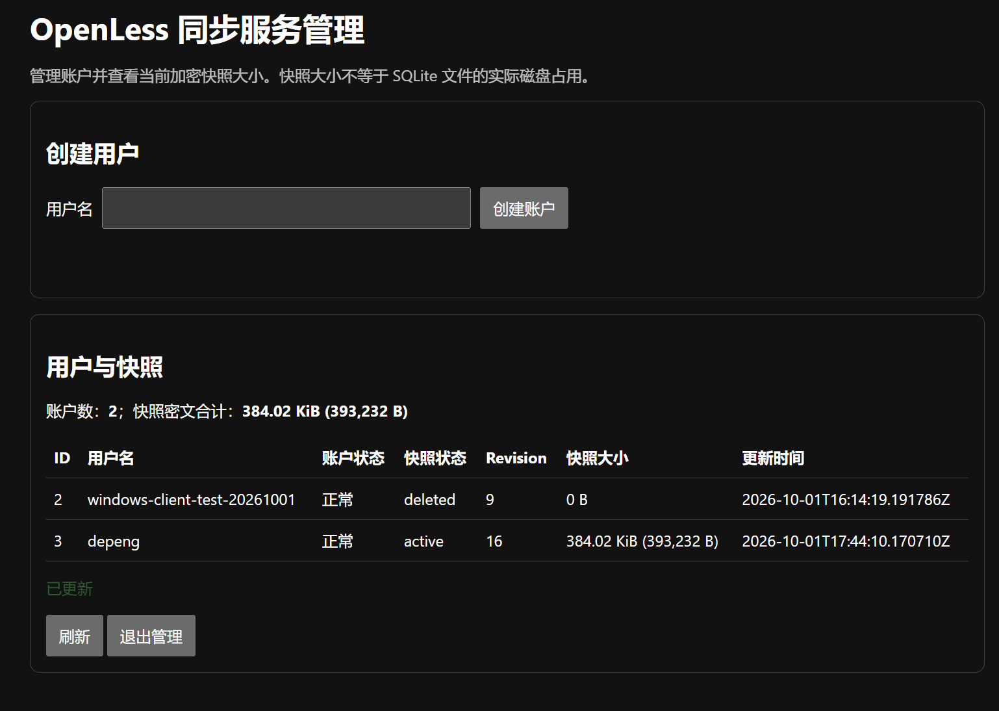

# OpenLess 自建同步服务器

[English](README.md) | 简体中文

基于 Docker Compose 的 OpenLess 自建同步 API。服务器将加密保险库快照作为不透明数据存储；加密和解密由客户端负责。

## 配置

以下是 `.env.example` 中的非敏感示例值：

```dotenv
DB_PATH=/app/data/sync.db
STORAGE_PATH=/app/data
PIP_INDEX_URL=https://pypi.tuna.tsinghua.edu.cn/simple
ADMIN_TOKEN=
```

`DB_PATH` 和 `STORAGE_PATH` 当前直接配置在 `docker-compose.yml` 中。`PIP_INDEX_URL` 可覆盖构建镜像时使用的软件包源。

如需启用管理页面，请在本地 `.env` 中设置至少 32 个字符的高强度随机值作为 `ADMIN_TOKEN`，然后打开 `/v1/admin` 并输入该值。页面支持创建账户和查看各账户当前快照密文大小；新账户的静态 token 只在创建成功时返回一次。未设置或长度不足时，管理 API 保持关闭。请勿将真实 `.env` 文件、静态 token、密码、私钥或证书内容提交到 Git。`data/` 下的运行数据已从 Git 中排除。

## 启动

```sh
docker compose up -d --build
```

服务在容器内监听 `8080` 端口。当前部署将容器端口绑定到宿主机回环地址的 `8081` 端口，再由 HTTPS 反向代理将 `/v1/` 请求转发到该端口。

## 协议与认证

服务器提供 OpenLess 自建同步协议：账户 ID 使用 SQLite 自增整数，并以十进制字符串对外返回；revision 在数据库中以整数存储，对外序列化为规范的十进制字符串。快照 JSON 原样存储和返回；服务器只解码密文字节以限制大小并计算 SHA-256，不会解密或解释加密的业务数据。PUT 和 DELETE 使用事务化比较并交换、完整操作回执和幂等重放。SQLite 使用 `DELETE` 日志模式、`synchronous=FULL` 和 `secure_delete=ON`；短期会话 token 以哈希形式存储。

认证由服务器自行管理：管理员可通过私有 `/v1/admin` 管理页或 `app.admin_cli` 创建账户和一次性返回的静态 token；`POST /v1/auth/token` 使用用户的静态 token 换取有效期为 15 分钟的 Bearer 会话，并返回 `protocolVersion` 和 `tokenType`。本项目不使用 GitHub OAuth。`githubClientId` capability 必须与 Windows 客户端的兼容值 `Ov23liyv3nEucG7oMHNE` 一致；`githubId` 和 `ownerGithubId` 字段承载本服务器的数字账户 ID（十进制字符串）。

可选的 `/v1/admin` 页面使用环境变量 `ADMIN_TOKEN` 作为固定管理令牌，并通过 `X-Admin-Token` 请求头验证。页面显示的是各账户当前密文大小，并非 SQLite 文件实际磁盘空间的精确分摊；管理令牌不会放在 URL 或浏览器持久化存储中。

### 管理界面示例

下图展示了创建账户后的管理页面；账户名、快照大小和时间均为截图拍摄时的状态。



启动迁移会保留空的 v2 账户和会话。如果 v2 数据库中存在已存储的快照，或仍在保留期内但不完整的 v2 操作回执，迁移会拒绝自动升级，因为无法无损地将这些数据转换为当前格式。

运行协议测试：

```sh
uv run --with-requirements requirements-test.txt python -m pytest -q
```

也可以在专用虚拟环境中安装 `requirements-test.txt` 后运行测试。

## OpenLess 当前同步范围（仅供参考）

以下仅概述 OpenLess 客户端 2.0 E2EE 云同步范围，作为了解上游产品的参考；这与本项目服务端自身的功能范围无关，也不构成兼容性承诺。详情见上游的[加密云同步文档](https://github.com/Open-Less/openless/blob/v2.0.0-Beta.4-tauri/docs/encrypted-cloud-sync.md)和[文档类型登记表](https://github.com/Open-Less/openless/blob/v2.0.0-Beta.4-tauri/openless-all/app/crates/openless-core/src/cloud_sync_e2ee_protocol/types.rs)。本服务端只原样存取一个不透明的加密快照，不会逐项解析或同步这些类别。

客户端采用显式白名单，包含 11 类逻辑文档：偏好设置与界面偏好、渠道与服务商凭据、词典与词汇预设、纠错记录、风格包、文本历史、活动记录和设备配置档案；删除通过 tombstone（删除标记）记录。服务商 API 密钥及相关设置仅作为客户端加密载荷的一部分上传。

OAuth 登录状态、同步 token/密码/派生密钥、设备私钥、远程输入 PIN、操作系统权限授权、录音音频、模型权重、缓存和应用程序二进制文件均不在同步范围内。恢复数据时也会保留设备绑定状态，且不会授予操作系统权限。

## 实现参考

服务端同步实现参考了 Open-Less 官方原始仓库 [Open-Less/openless-cloud-sync](https://github.com/Open-Less/openless-cloud-sync)，其原始登录流程使用 GitHub 认证。本项目借鉴的是同步服务端的实现与行为，**不沿用 GitHub 认证，也不依赖 GitHub 作为同步机制**；这里由管理员在本机签发静态 token，自行管理认证。
